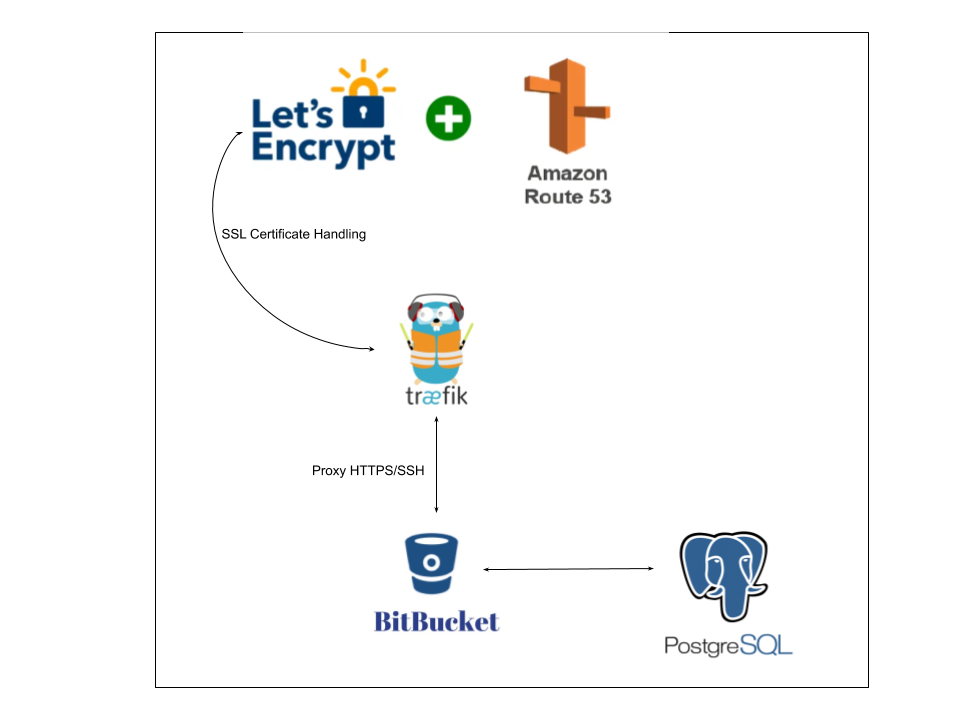
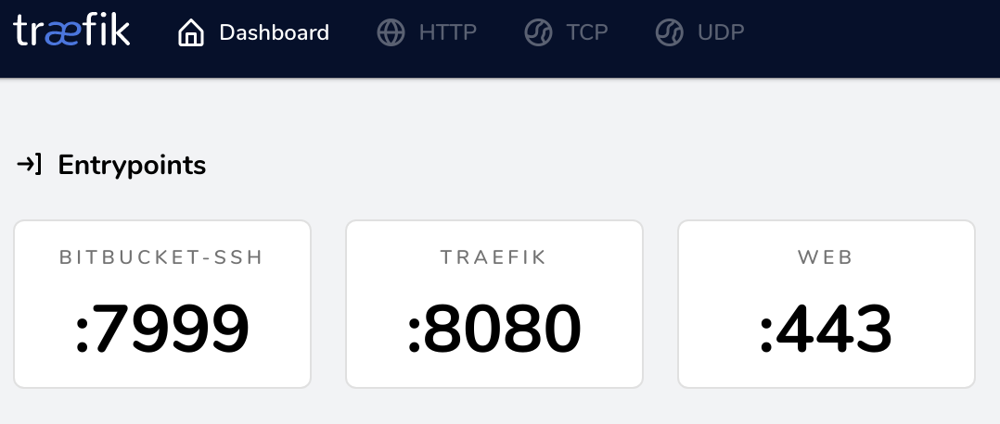
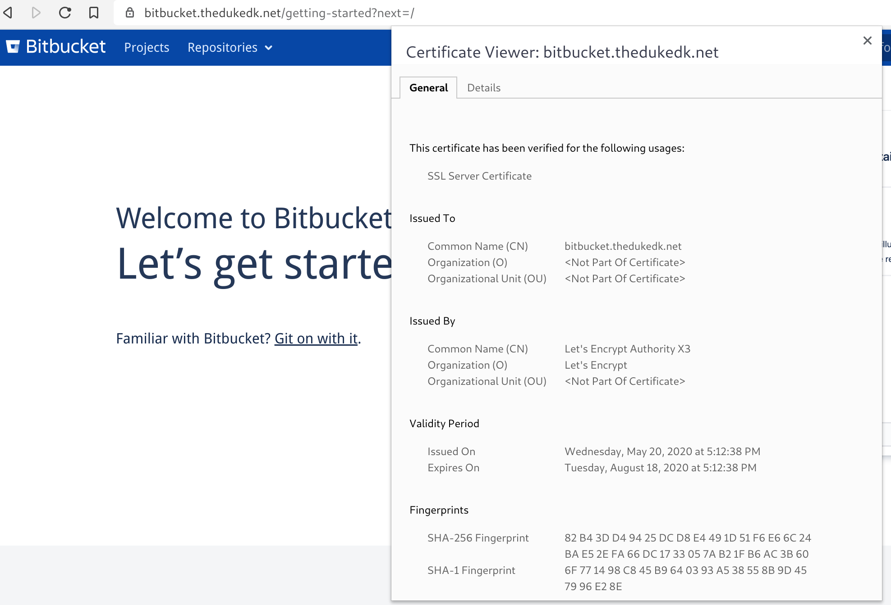

# Bitbucket, Traefik & SSL, Postgres - Docker and Docker Compose
This repository demonstrates how to use Atlassian's official [Bitbucket docker image](https://hub.docker.com/r/atlassian/bitbucket-server), The official [PostgreSQL image](https://hub.docker.com/_/postgres) and [Traefik](https://containo.us/traefik/) as a proxy handling SSL certificate management through [LetsEncrypt](https://letsencrypt.org/) with AWS route53.

## Overview
Intended as a simple setup deployed on **one virtual machine (VM)** and orchestrated by docker-compose. Backups can be done with nightly snapshots or scripted. There is a **very simple** backup.sh script which demonstrates how to backup both the file system and the database locally on the machine. You could have CI server execute it and store the backups if wanted. 

Traefik proxies:

* SSH on TCP port 7999
* Traefik Dashboard on port 8080
* Bitbucket on port 443

## Requirements

* A domain registered in AWS Route53 for domain verification with LetsEncrypt for SSL cert management. Example: `thedukedk.net`.
* AWS Account ID and the corresponding secret.
* Linux Host with Docker and Docker Compose installed. 

## Preparation
* Fill out the variables in the `.env` file.
* Add the FQDN to your hosts file. **Must** match `SERVER_PROXY_NAME` in the `.env` file. Example: `bitbucket.thedukedk.net`.

## Run

`docker-compose -f traefik-compose.yml -f postrges-compose.yml -f bitbucket-compose.yml up -d`

## Access
* Traefik Dashboard: http://localhost:8080
* Bitbucket: FQDN. Example: `https://bitbucket.thedukedk.net`.

## Upgrade process
See the `notes.txt` file for a description of a simple upgrade process.